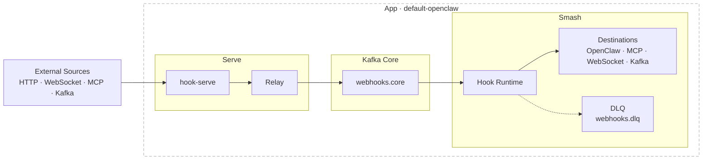

# hook 🏓 workbench - serve. relay. smash.

<p align="center">
  
</p>

`hook` is a contract-driven event workbench with three runtime roles:
- `serve`: ingress (receive/validate/normalize/sanitize -> Kafka)
- `relay`: Kafka core bridge
- `smash`: egress (consume Kafka -> adapter delivery) (openclaw, agents, etc.)

See [Changelog](docs/CHANGELOG.md) for the 2026-03-04 architecture shift and plugin rollout.

## Current Architecture



Kafka remains mandatory between ingress and egress in all active profiles.

## Ingress and Egress Options

| Side | Driver | Purpose |
|---|---|---|
| serve ingress | `http_webhook_ingress` | Receive source webhooks over HTTP |
| serve ingress | `websocket_ingress` | Receive JSON frames over WebSocket |
| serve ingress | `mcp_ingest_exposed` | Expose MCP ingest endpoint for push |
| serve ingress | `kafka_ingress` | Consume external Kafka as ingestion |
| smash egress | `openclaw_http_output` | Deliver to OpenClaw hook endpoint |
| smash egress | `mcp_tool_output` | Call MCP tool via transport |
| smash egress | `websocket_client_output` | Push to external WebSocket server |
| smash egress | `websocket_server_output` | Host WebSocket endpoint and broadcast |
| smash egress | `kafka_output` | Produce to external Kafka topic |

## Plugin System (Serve and Smash)

Both sides support adapter plugins via `plugins = [...]` in contract config.

Supported plugin drivers:
- `event_type_alias`
- `require_payload_field`
- `add_meta_flag`

Behavior:
- Plugins execute in declaration order.
- `require_payload_field` fails closed when the pointer is missing.
- `add_meta_flag` writes deduplicated flags to envelope metadata.

## Repository Layout

- `src/`: `hook-serve` serve runtime
- `tools/hook/`: CLI/operator control plane (`serve`, `relay`, `smash`, ops commands)
- `apps/default-openclaw/contract.toml`: canonical compatibility contract
- `apps/kafka-openclaw-hook/`: compatibility binary wrapper for smash runtime
- `crates/hook-runtime/`: runtime execution engine (adapters + smash runtime)
- `crates/relay-core/`: shared contracts, validator, model, signatures, sanitize
- `config/kafka-core.toml`: Kafka-core defaults/schema example
- `docs/references/`: runbooks and migration/legacy references
- `firecracker/`, `systemd/`, `scripts/`: deployment and operational tooling

## Contracts and Profiles

Runtime behavior is defined in `apps/<app>/contract.toml` and activated via profile.

Contract discovery order for `hook serve` and `hook smash`:
1. `--contract <path>`
2. `--app <id>` -> `apps/<id>/contract.toml`
3. `./contract.toml`
4. embedded `default-openclaw` fallback

Important validator behavior:
- Unsupported drivers are rejected only when active in selected profile.
- Inactive unsupported drivers may exist in the same contract.
- Validation is strict fail-closed by default.

## CLI Quick Start

```bash
cargo install --path tools/hook

hook --help
hook debug capabilities
hook serve --app default-openclaw
hook relay --topics webhooks.github,webhooks.linear --output-topic webhooks.core
hook smash --app default-openclaw
```

## Environment and Config

Start from `.env.default`:

```bash
cp .env.default .env
```

Minimum required values usually include:
- `KAFKA_BROKERS`
- source auth secrets for enabled sources (`HMAC_SECRET_GITHUB`, `HMAC_SECRET_LINEAR`, etc.)
- destination auth secrets for active smash adapters (for example `OPENCLAW_WEBHOOK_TOKEN`)

Security guardrail:
- Plaintext Kafka requires explicit opt-in:
  - `KAFKA_SECURITY_PROTOCOL=plaintext`
  - `KAFKA_ALLOW_PLAINTEXT=true`

## Build and Test

```bash
cargo fmt --all
cargo clippy --workspace --all-targets -- -D warnings
cargo test --workspace
cargo build --workspace --release
```

## Release

Build release artifacts:

```bash
scripts/build-release-binaries.sh
```

Crates dry-run publish:

```bash
scripts/publish-crates.sh --dry-run
```

See:
- `docs/references/release-publishing.md`

## Additional Docs

- [apps/README.md](apps/README.md)
- [crates/README.md](crates/README.md)
- [tools/hook/README.md](tools/hook/README.md)
- [docs/README.md](docs/README.md)
- [docs/references/README.md](docs/references/README.md)
- [docs/spec.md](docs/spec.md)
- [docs/roadmap.md](docs/roadmap.md)
- [SKILL.md](SKILL.md)
